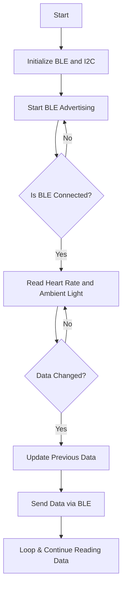

# heart-rate-ambient-light
# Heart Rate and Ambient Light Monitoring with BLE

This program reads heart rate data from an HRS3300 sensor and ambient light data, then transmits them via Bluetooth Low Energy (BLE) using the Adafruit Bluefruit library. The data is sent in real-time to a connected BLE device.

## Libraries Used
- `Arduino.h`: Core Arduino functions.
- `Wire.h`: I2C communication.
- `HRS3300lib.h`: Library for the HRS3300 heart rate sensor.
- `bluefruit.h`: Adafruit Bluefruit BLE library.

## Program Structure
1. **BLE and I2C Initialization**
   - Initializes the BLE module and configures the device name.
   - Sets up the I2C communication for the HRS3300 sensor.
2. **Start BLE Advertising**
   - Enables BLE advertising so that the device can be discovered.
3. **Read and Transmit Data**
   - Reads heart rate and ambient light sensor values.
   - Sends the data via BLE only if there is a change in values.
4. **I2C Read/Write Functions**
   - Custom functions to read and write data over I2C for sensor communication.

